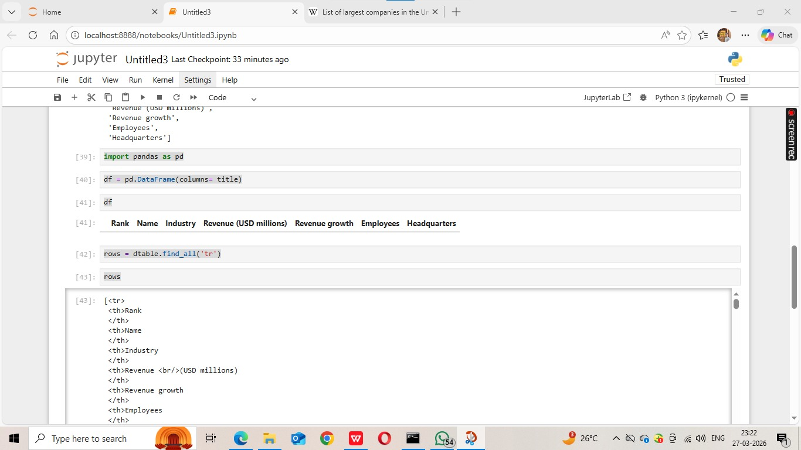
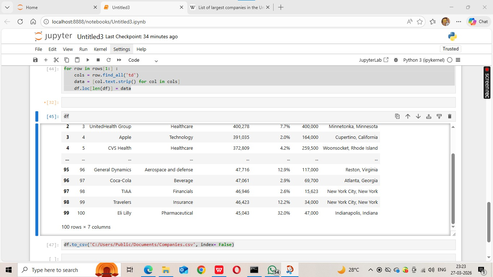
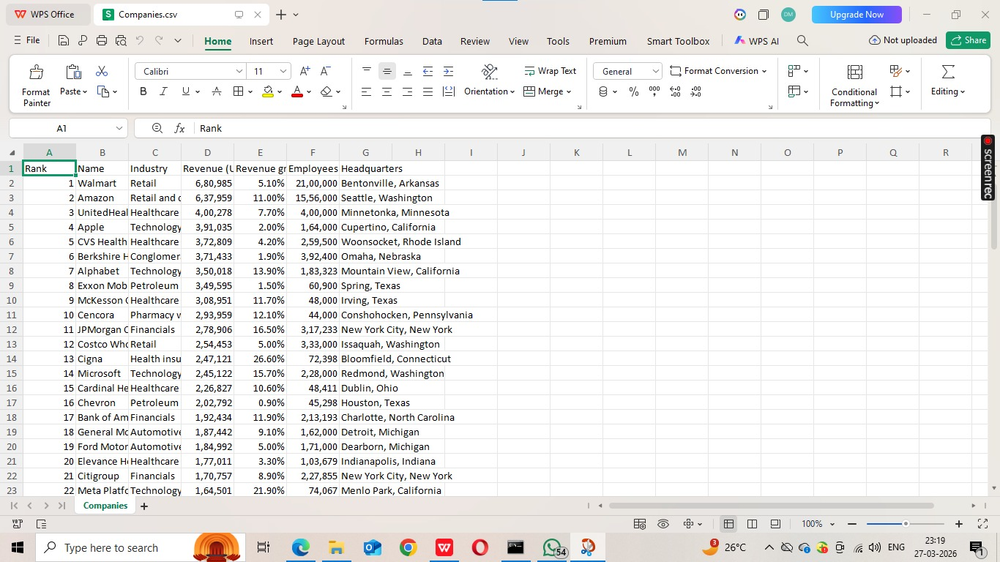

# 🌐 Web Scraping Companies Data | Python Project

A web scraping project built using Python, BeautifulSoup, and Pandas to extract company data from a real website and store it in a structured CSV format.

---

## 📌 Overview

This project extracts company-related data from a website (Wikipedia) using web scraping techniques and converts it into a structured dataset for analysis.

---

## 📸 Screenshots

### 🌍 Source Website (Wikipedia Page)


### 💻 Jupyter Notebook Code

  
  
  


### 📊 Output CSV File



---

## 🔧 Tools & Technologies

- Python  
- BeautifulSoup  
- Requests  
- Pandas  
- Jupyter Notebook  

---

## ⚙️ Features

- Scrapes company data from HTML tables  
- Parses and cleans raw data  
- Converts data into Pandas DataFrame  
- Exports structured data into CSV  
- Provides both Notebook and Python script  

---

## 📁 Project Files

- `Untitled3.ipynb` → Jupyter notebook implementation  
- `Untitled3.py` → Python script version  
- `Companies.csv` → Final dataset  
- `image_proof/` → Screenshots of process  

---

## 📊 Output

The final dataset is stored in:

```bash
Companies.csv
